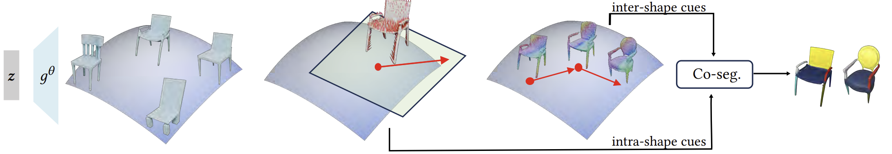
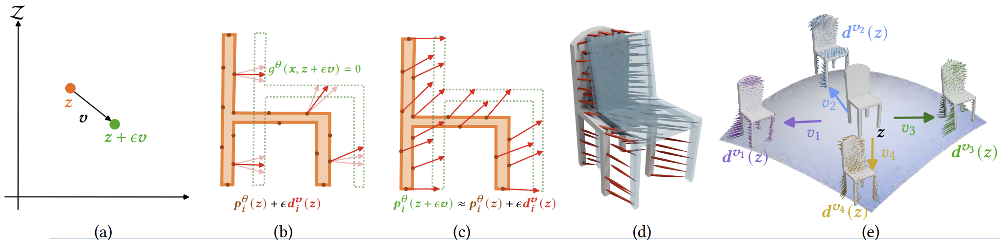
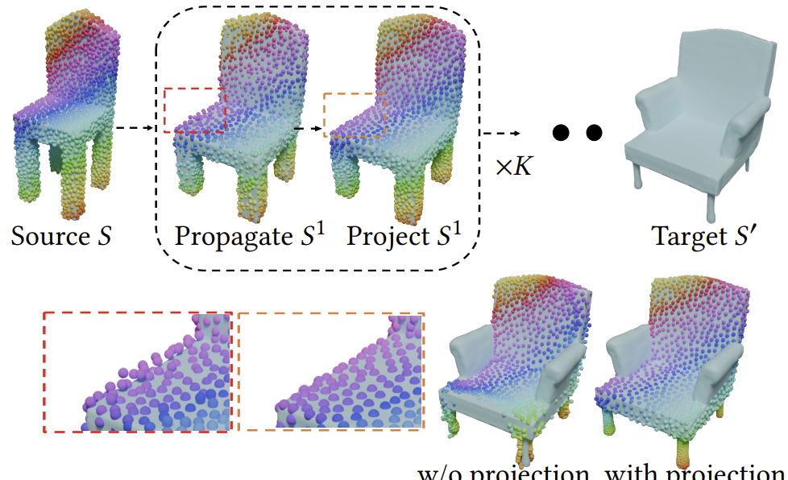
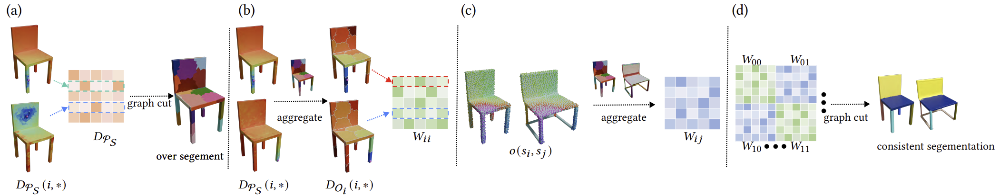
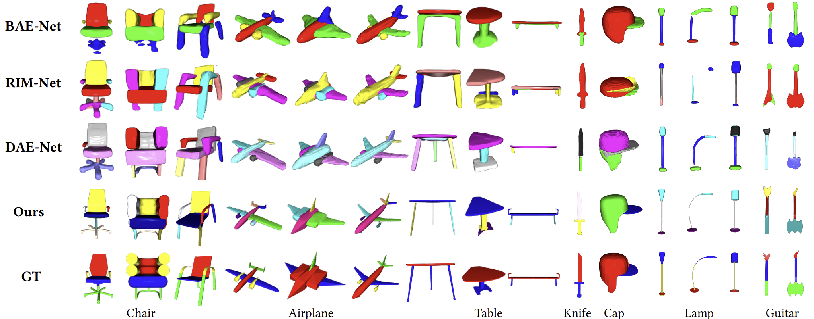

<html lang="en">

<head>
  <!-- Required meta tags -->
  <meta charset="utf-8">
  <meta name="viewport" content="width=device-width, initial-scale=1, shrink-to-fit=no">
  
  

  <!-- Bootstrap CSS -->
  <link rel="stylesheet" href="https://maxcdn.bootstrapcdn.com/bootstrap/4.0.0/css/bootstrap.min.css"
    integrity="sha384-Gn5384xqQ1aoWXA+058RXPxPg6fy4IWvTNh0E263XmFcJlSAwiGgFAW/dAiS6JXm" crossorigin="anonymous">

  <title>GenAnalysis</title>

  
</head>

<body>

  

    

      <h2> GenAnalysis: Joint Shape Analysis by Learning Man-Made Shape Generators with Deformation Regularizations </h2>

      <!-- Authors -->
      

        Yuezhi Yang1
        Haitao Yang1
        Kiyohiro Nakayama2
        Xiangru Huang3
        Leonidas Guibas2
        Qixing Huang1
      

      <!-- Affiliations -->
      

        1The University of Texas at Austin
        2Stanford University
        3Westlake University
      

    

    <!-- Links -->
    

      
        <a href="https://arxiv.org/abs/2503.00807">[Paper (SIGGRAPH 2025)]</a>
        <a href="https://github.com/yyuezhi/GenAnalysis">[Code]</a>
      
    

    <!-- Teaser -->
    

      

        
      

      

        

          <strong>TLDR:</strong> We enforce an as-affine-as-possible (AAAP)
deformation between adjacent shapes of the implicit generator by introducing an regularization loss. From that, we extract piecewise-affine vector fields that yield shape segmentation cues and derive shape correspondences by iteratively propagating AAAP deformations across a sequence of intermediate shapes. Finanlly we obtain consistent segmentation and shape correspondence.
        

      

    

    <!-- Overview -->
    

      <h3 class="text-center">- Overview -</h3>
      

        

          We present GenAnalysis, an implicit shape generation framework that allows joint analysis of man-made shapes, including shape matching and joint shape segmentation. The key idea is to enforce an as-affine-as-possible (AAAP) deformation between synthetic shapes of the implicit generator that are close to each other in the latent space, which we achieve by designing a regularization loss. It allows us to understand the shape variation of each shape in the context of neighboring shapes and also offers structure-preserving interpolations between the input shapes. We show how to extract these shape variations by recovering piecewise affine vector fields in the tangent space of each shape. These vector fields provide single-shape segmentation cues. We then derive shape correspondences by iteratively propagating AAAP deformations across a sequence of intermediate shapes. These correspondences are then used to aggregate single-shape segmentation cues into consistent segmentations. We conduct experiments on the ShapeNet dataset to show superior performance in shape matching and joint shape segmentation over previous methods.
        

      

    

    <!-- Method -->
    

      <h3 class="text-center">- Method -</h3>
      

        
      

      

        

          Our pipeline (a) trains an implicit generator with an AAAP deformation loss;
          (b) extracts piece-wise affine vector fields from each shape’s tangent space;
          (c) composes correspondences along intermediate shapes; and
          (d) performs consistent segmentation using the
correspondences obtained in stage three to integrate single-shape segmentation cues derived from stage two.
        

      

      

        
      

        

          As-affine-as-possible (AAAP) regularization. (a) We study infinitesimal perturbation 𝒗 in the tangent space at each shape with latent code 𝒛. (b)
Due to implicit constraint, we can not determine the correspondence 𝒅
(𝒛) that lies on 𝑔
(𝒙, 𝒛 + 𝜖𝒗) = 0 directly. (c) We instead jointly compute all
𝒅 by solving an constrained optimization problem using the as-affine-as-possible energy. (d) We show resulting 3D correspondences between source
shape colored in white, and a neighboring perturbed shape colored in transparent blue. (e) After derivation, we arrived at closed form solution
shown  where each perturbation 𝒗 corresponds to variation at 𝒅.
        

      

      

        
      

      

        

           Correspondence computation from the source shape through intermediate shapes to the target. Points share the same colours as they move;
alternating propagation and projection steps keep them on the surface.
Without projection, correspondences drift away and fail to lie on the target.
        

      

      

        
      

      

        

          Overview of our consistent-segmentation algorithm. (a) We compute over-segments for each shape  using its distance matrix 
. We
aggregate (b) affine fitting distance function in each shape and (c) correspondence between each shape pair by over segments.(d) We perform spectral
clustering among over-segments of all shapes. Spectral clustering employs an block-wise affinity matrix that encodes each single-shape segmentation cues in
its diagonal blocks and correspondences between structurally similar shapes in its off-diagonal blocks.
        

      

  

    <!-- Results / Demo -->
    

      <h3 class="text-center">- Results -</h3>
      
      

        

          Please see more result on paper.
        

      

    

    <!-- Citation -->
    

      <h3 class="text-center">- Citation -</h3>
      

        <pre style="text-align: left; font-size: 14px;"><code>
@article{yang2025genanalysis,
  title   = {GenAnalysis: Joint Shape Analysis by Learning Man-Made Shape Generators with Deformation Regularizations},
  author  = {Yang, Yuezhi and Yang, Haitao and Nakayama, Kiyohiro and Huang, Xiangru and Guibas, Leonidas and Huang, Qixing},
  journal = {arXiv preprint arXiv:2503.00807},
  year    = {2025}
}
        </code></pre>
      

    

  

</body>
</html>
