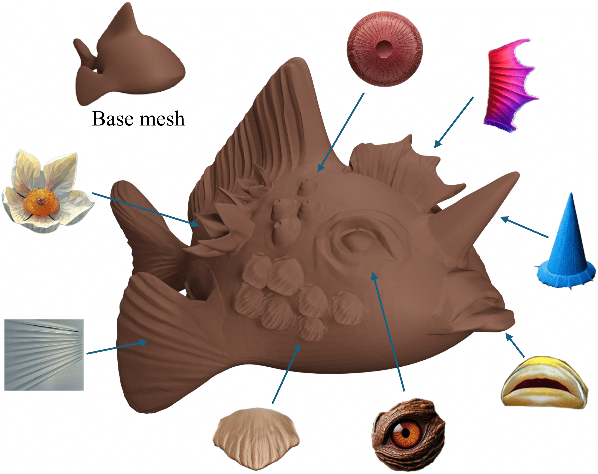
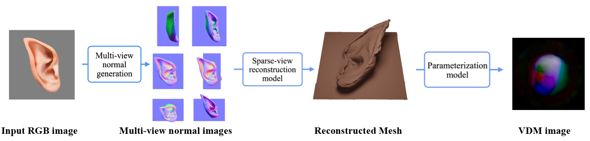
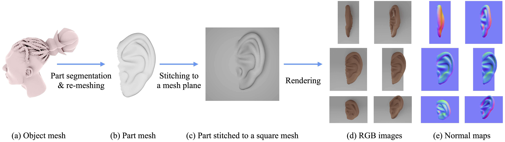

<html lang="en">

<head>
  <!-- Required meta tags -->
  <meta charset="utf-8">
  <meta name="viewport" content="width=device-width, initial-scale=1, shrink-to-fit=no">
  
  

  <!-- Bootstrap CSS -->
  <link rel="stylesheet" href="https://maxcdn.bootstrapcdn.com/bootstrap/4.0.0/css/bootstrap.min.css"
    integrity="sha384-Gn5384xqQ1aoWXA+058RXPxPg6fy4IWvTNh0E263XmFcJlSAwiGgFAW/dAiS6JXm" crossorigin="anonymous">

  <title>GenVDM</title>

  

</head>

<body>

  

    

      <h2> GenVDM: Generating Vector Displacement Maps From a Single Image </h2>
      

        <a href="https://yyuezhi.github.io/">Yuezhi Yang1</a> 
        <a href="https://qiminchen.github.io/">Qimin Chen2</a> 
        <a href="http://www.vovakim.com/">Vladimir G. Kim3</a> 
        <a href="https://www.cse.iitb.ac.in/~sidch/">Siddhartha Chaudhuri3</a> 
        <a href="https://www.cs.utexas.edu/~huangqx/">Qixing Huang1</a> 
        <a href="https://czq142857.github.io/">Zhiqin Chen2</a> 
      

      

        1The University of Texas at Austin
        2Simon Fraser University
        3Adobe Research
      

    

    

      
        <a href="https://www.arxiv.org/abs/2503.00605">[Paper (CVPR 2025)]</a>
        <a href="https://github.com/yyuezhi/GenVDM/">[Code]</a>
        <a href="https://github.com/yyuezhi/GenVDM/">[Data]</a>

  

    

      
    

    

      

        <strong>TLDR:</strong> We introduce GenVDM, a method that can generate
        a highly detailed Vector Displacement Map (VDM) from a single
         image. The generated VDMs can be directly applied to mesh
        surfaces to create intricate geometric details.
      

    

  

    

      <h3 class="text-center">
        - Interactive Modeling -
      </h3>
    

      

      

      Given input image shown on top-right, our method could generate VDM in .exr format, which could directly be used in blender for interactive modelling.
      

      

    
    

    

      <h3 class="text-center">
        - Overview -
      </h3>
      

      

            We introduce the first method for generating Vector Displacement Maps (VDMs): parameterized, detailed geometric stamps commonly used in 3D modeling. Given a single input image, our method first generates multi-view normal maps and then reconstructs a VDM from the normals via a novel reconstruction pipeline. We also propose an efficient algorithm for extracting VDMs from 3D objects, and present the first academic VDM dataset. Compared to existing 3D generative models focusing on complete shapes, we focus on generating parts that can be seamlessly attached to shape surfaces. The method gives artists rich control over adding geometric details to a 3D shape. Experiments demonstrate that our approach outperforms existing baselines. Generating VDMs offers additional benefits, such as using 2D image editing to customize and refine 3D details. 
      

      

    

    

      <h3 class="text-center">
        - Method -
      </h3>
      

        
      

      

      

          Our image-to-VDM pipeline. Given an input image, we first utilize a multi-view image diffusion model to generate six normal maps with predefined camera pose. We then reconstruct an accurate (but perhaps noisy) mesh from the multi-view normals with differentiable rendering and neural SDF representation. Then we parameterize the mesh by fitting a deformable square to it with a neural deformation field. An VDM image can thus be obtained by discretizing the square into pixels and infer each pixel’s displacement from the neural deformation field.
      

      

    

    

      <h3 class="text-center">
        - Data Preparation -
      </h3>
      

        
      

      

        

          Our data preparation pipeline. For each interesting object from Objaverse (a), we use a 3D lasso tool to segment out interesting parts. For each part, we densely sample points on the part's surface and then perform Screened Poisson Surface Reconstruction to obtain a single connected mesh (b). We then stitch the mesh to a square mesh with an algorithm inspired by Poisson Image Editing (c). Afterwards, we can color the part and render RGB images (d) and normal maps (e) for training the image diffusion model.
        

      

    

    

      <h3 class="text-center">
        - Citation -
      </h3>
      

        <pre style="text-align: left; font-size: 14px;"><code>
    @inproceedings{yang2025GenVDM,
      title={GenVDM: Generating Vector Displacement Maps From a Single Image},
      author = {Yang, Yuezhi and Chen, Qimin and Kim, Vladimir G. and Chaudhuri, Siddhartha and Huang, Qixing and Chen, Zhiqin},
      booktitle={Conference on Computer Vision and Pattern Recognition},
      year={2025},
    }
        </code></pre>
      

    

